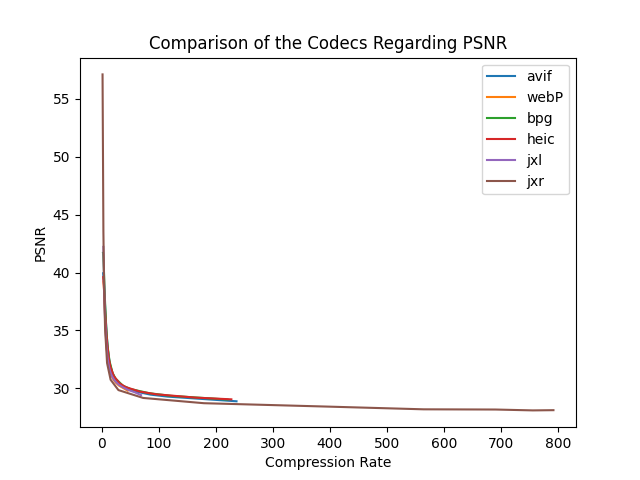
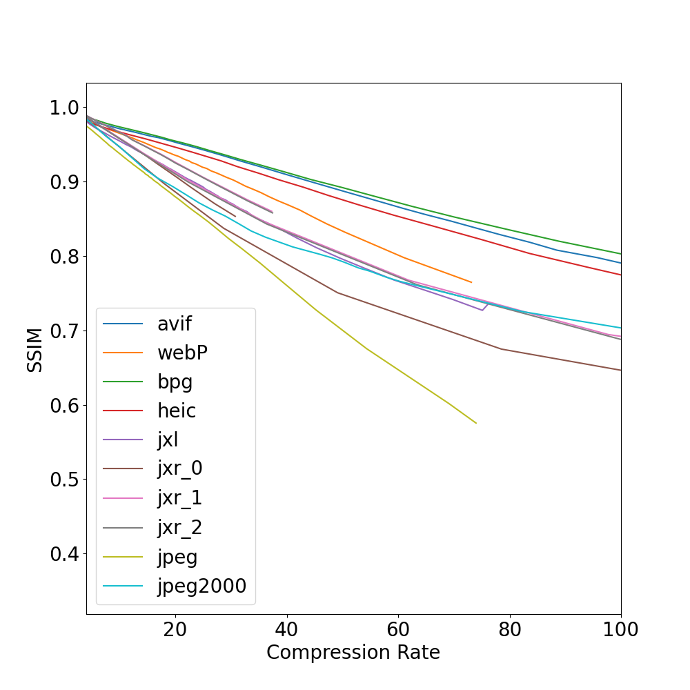

# UNI-AIS-MediaDataFormats

Repositiory for the Media Data Formats proseminar group with the topic compression of images to a fixed file size & detection of compression algorithm used in the compression with the following codecs:

- JPEG XL
- WebP
- HEIC/HEIF
- JPEG XR (with overlap Parameter 0, 1 & 2)
- BPG
- AVIF
- Additional Codecs added later
  - JPEG
  - JPEG 2000

## Description

The goal of this project was to first compress images to a specified filesize. This means that an image would be compressed to a file size of for example 5 KB by dialing in the quality setting of the encoder to get just below this threshold. Due to the fact that every image is different one need to figure out the matching quality setting for each image sepereatly. To reduce the calcualtion time a divide and conquer approach was used.

In short the image was saved with the quality setting at half of the possible quality values. Then the resulting filesize is determied if its larger than determined the quality will be reduced to the lower half else to the upper half. E.g. First run with Quality 50 -> File size to large next quality step will be 25. If the file size is under the threshhold the next Quality step would be hafway between 25 and 50. And so on until the desired file size is reached for a quality setting with 100 values this would lead to a result within 8 steps.

Since every compression algorithm has different charachterristics at different leves of compression there is a need to compress to differnt file sizes. The ituition beeing that a more compressed image would be easier to classify than a less compressed since the artifacts inherent to the algorithm would not be as strong. The files sizes used were: 5, 10, 17, 25, 32, (40, 50, 60, 75, 100). While the Former ones were used to train the models and the ladder ones only to observe the accuracy of the network with less compressed images.

To classify the compressed images the compressed images were converted back into a png so all the compression types would behave the same. To classify the compressed images a resnet-18 in pyytorch was used. On the one hand with transfere learning and on the other hand by starting from scrach.

## Dataset & Structure

The dataset used for this project is the DIV2K dataset. This dataset contains 900 images. The images are split into 800 train and 100 validation images.
The folders under the DIV2K folder with the codes are just for working within. After this the file is saved as a lossless png in the Decoded folder. This is done so the Training of the model can happen without compatiability problems of the training framework. The images are saved in the following structure:

```
Images
├── DIV2K_train_HR
│   (Folders for Encoding, Decoding and working with the images)
│   ├── Reziezed (original images resized to 512x512)
│   ├── JPEG / JPEG2000 / ... (Folders for Encoding and working with the images)
│   ├── Decoded (Images after decoding to png, used for training)
│   ├── ...
│   (Images from DIV2K)
│   ├── 0001.png
│   ├── 0002.png
│   ├── ...
├── DIV2K_train_HR
│   ├── Reziezed
│   ├── JPEG / JPEG2000 / ...
│   ├── Decoded
│   ├── ...
│   ├── 0801.png
│   ├── 0802.png
│   ├── ...
```

## Software & Preprocessing

### Used Software

- General Requirements

    ```sh
    # For Preprocessing
    conda install pillow # version 9.4.0
    pip install imagecodecs # version 2023.3.16
    # Training
    conda install torch torchvision # torch version 2.0 torchvision version 0.15
    ```

- Pillow
  - JPEG
  - WebP
- Pillow Plugins
  - AVIF [Pip Pillow AVIV Plugin](https://pypi.org/project/pillow-avif-plugin/)

    ```sh
    pip install pillow-avif-plugin # version 1.3.1
    ```

  - HEIC [Pip Pillow HEIF Plugin](https://pypi.org/project/pillow-heif/)

    ```sh
    pip install pillow-heif # version 0.10.1
    ```

- apt
  - JPEG 2000

    ```sh
    sudo apt install libopenjp2-7 libopenjp2-tools # verion openJPEG 2.5.0
    ```

    _Alternatively this will be installed with pytorch / torchvision in the environment_

  - JPEG XR

    ```sh
    sudo apt-get install libjxr-dev
    sudo apt-get install libjxr-tools # version 1.1
    ```

    _Alternatively this will be installed with imagecodes in the environment_

- Homebrew / Linux Brew for
  - BPG

    ```sh
    brew install libbpg # version 0.9.8
    ```

  - JPEX XL

    ```sh
    brew install jpeg-xl # version 0.8.2
    ```

### Running the Scripts

To runn the preprocessing the `preprocessingAll.py` script has to be executed. This will first crop the images the 512x512 pixel size on witch the file sizes were based. After the crop the images ware first compressed to the right file size and afterwards saved as a png in the decoded folder.

> **Note:**
>
> This currently does not work for JPEG XR these should be excluded from the run and all run seperatly in seperate terminal instances.
>
> To crop more image out of one image (center, left upper -, left lower -, right upper - right lower corner). Run the `cropImages.py` script with the argument 5 (`python scripts/cropImages 5`) to get 5 images out of 1 image. This will ropt the Images to the ResizedInPecies Folder in the train and valid folders.

To train the network use eatither the `cnnTrain.py`, `pretrainedCNN.py` or the `pretrainedCNNFilesize.py` scripts. These will either start the training form 0, use the pretrained resnet 18 weights for all files sizes or just a single file size. The pretrained networks will save the model weights to the models folder.

## Results

### PSNR over Compression Ratio of the Codecs (Mean over 5 images)



### SSIM over Compression Ratio of the Codecs (Mean over 5 images)



## Authors

- Stefan Findenig
- Michael Hafner
- Moritz Langer
- Aleksander Radovic
